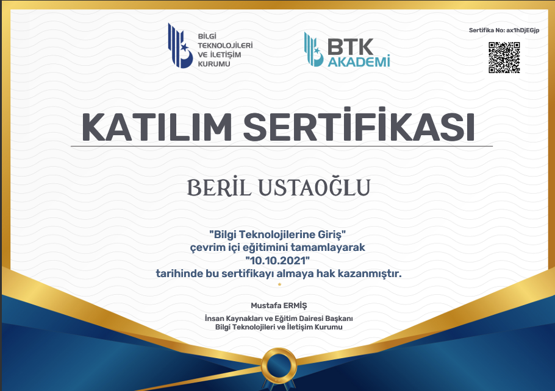
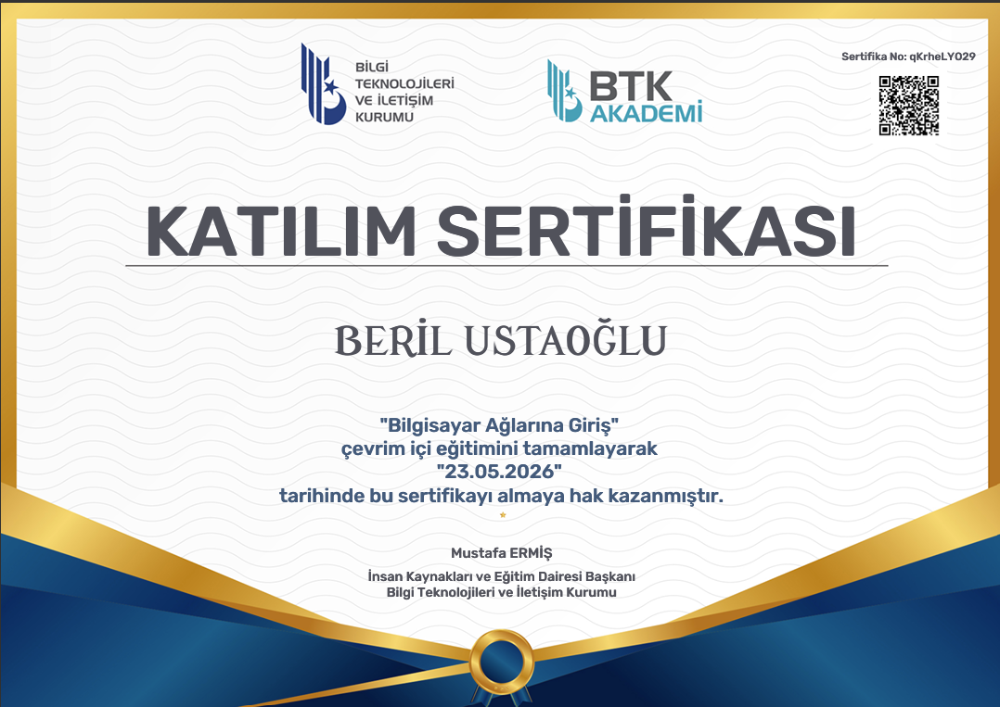
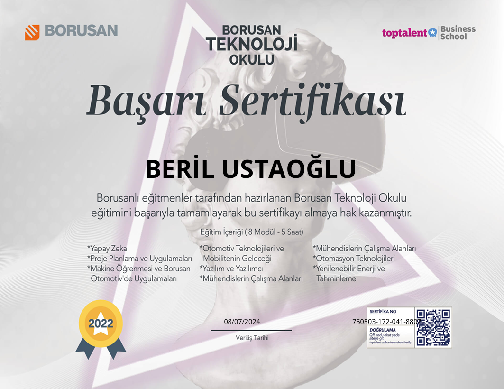
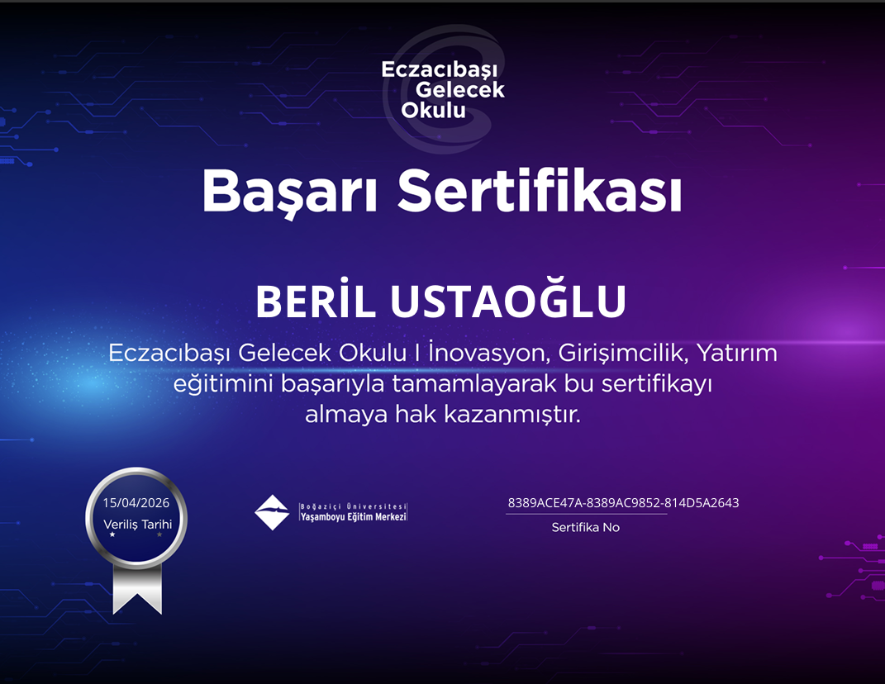
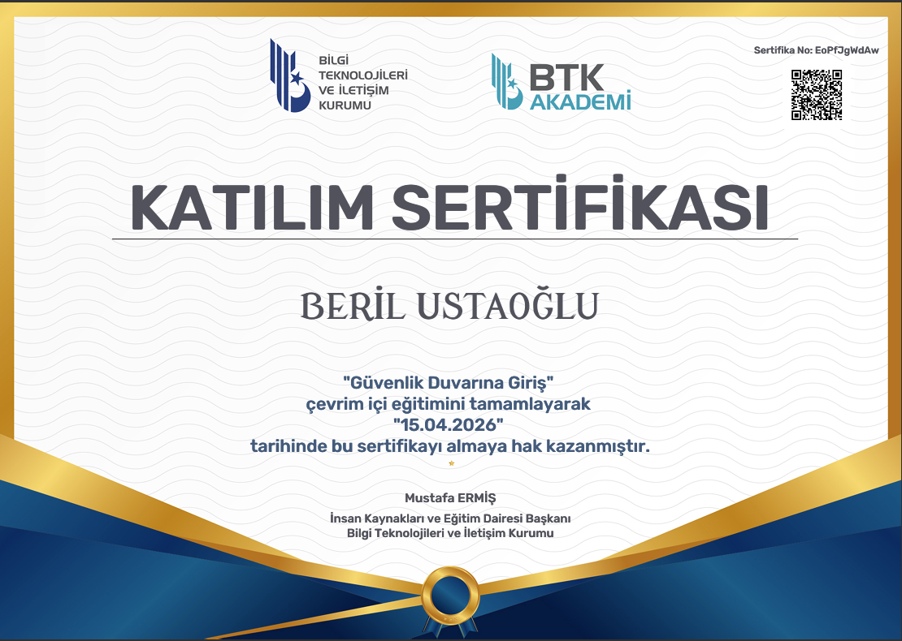
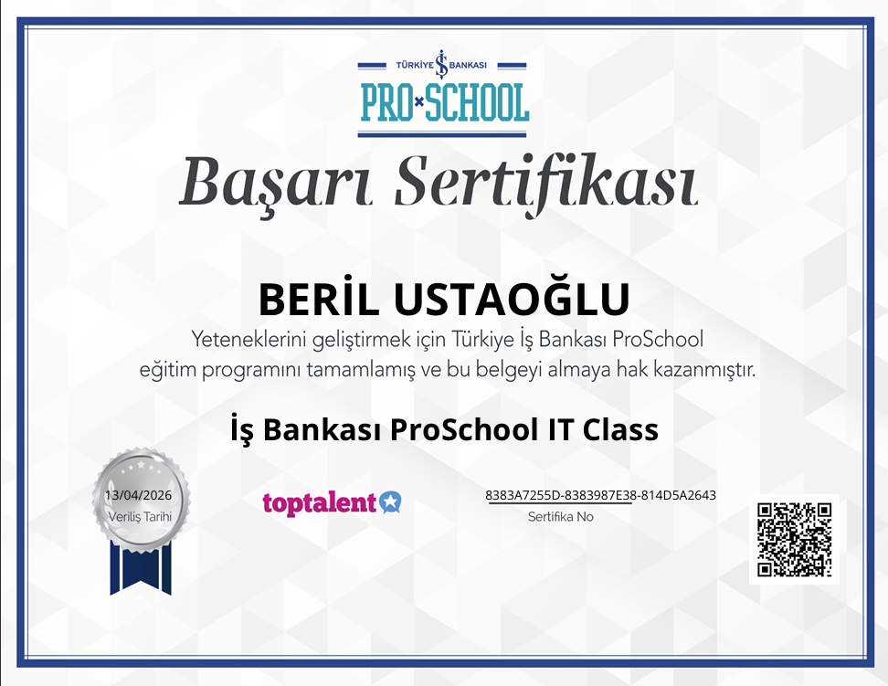
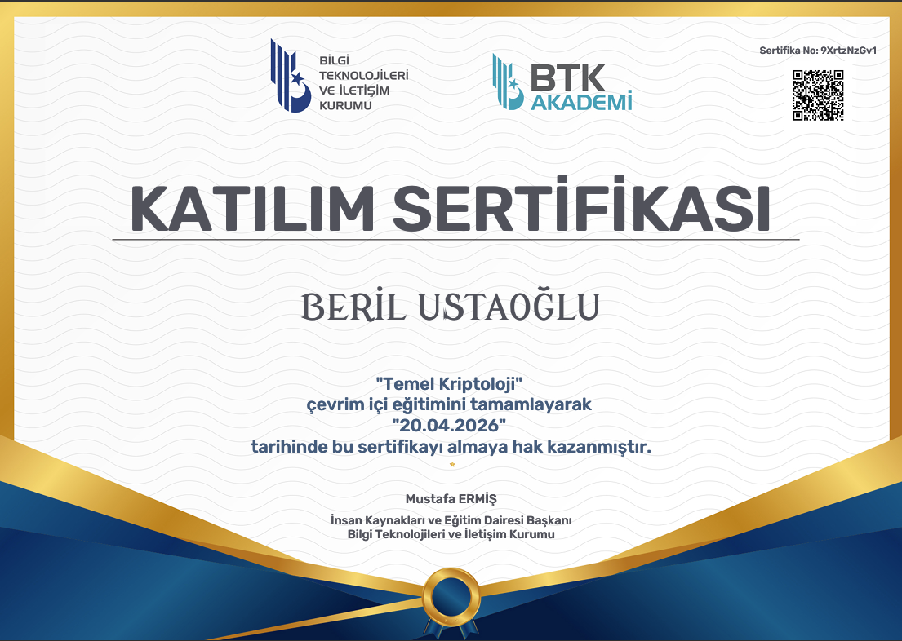

# 👋 Hi, I'm a Cybersecurity Enthusiast!

Siber güvenlik alanında kendimi geliştiren, ofansif ve defansif güvenlik süreçlerine ilgi duyan bir araştırmacıyım. GitHub profilimde geliştirdiğim güvenlik araçlarını ve laboratuvar çalışmalarımı bulabilirsiniz.
I am a researcher specializing in cybersecurity, interested in both offensive and defensive security processes. You can find the security tools I've developed and my lab work on my GitHub profile.

## 🛠️ Tech Stack & Tools (Kullandığım Araçlar)
- **Languages:** Python, C#, SQL
- **Tools:** Nmap, Wireshark, VirtualBox
- **OS:** Kali Linux,  Windows

## 📜 Certificates & Achievements (Sertifikalarım ve Belgelerim)

Burada siber güvenlik alanında tamamladığım eğitimler ve aldığım belgeler yer almaktadır:
Here you will find the training I have completed and the certificates I have received in the field of cybersecurity:

### 1. BTK Akademi Bilgi Teknolojilerine Giriş

### 2. BTK Akademi Bilgisayar Ağlarına Giriş

### 3. Borusan Teknoloji Okulu

### 4. Eczacıbaşı Gelecek Okulu

### 5. BTK Akademi Güvenlik Duvarına Giriş

### 6. İş Bankası ProSchool

### 7. BTK Akademi Sosyal Mühendislik

### 8. BTK Akademi Temel Kriptonoloji

---
📫 Nasıl Ulaşabilirsiniz?:  berilatsu@gmail.com
📫 How to contact us?:  berilatsu@gmail.com
   
